# Top 15 Popup Builder Tools Ranked in 2025 (Latest Compilation)

You've spent time and money getting people to your website, but most of them just browse and leave. That's where popup builders come in. The right popup tool can turn silent visitors into email subscribers, paying customers, or engaged fans. Whether you're running an online store, a SaaS platform, or a content site, these tools help you capture attention at the perfect moment without being annoying about it. Below are the best popup builders that actually deliver results, ranked by their overall value for different business needs.

***

## **[Claspo](https://claspo.io)**

Your all-in-one solution for engagement without the learning curve.

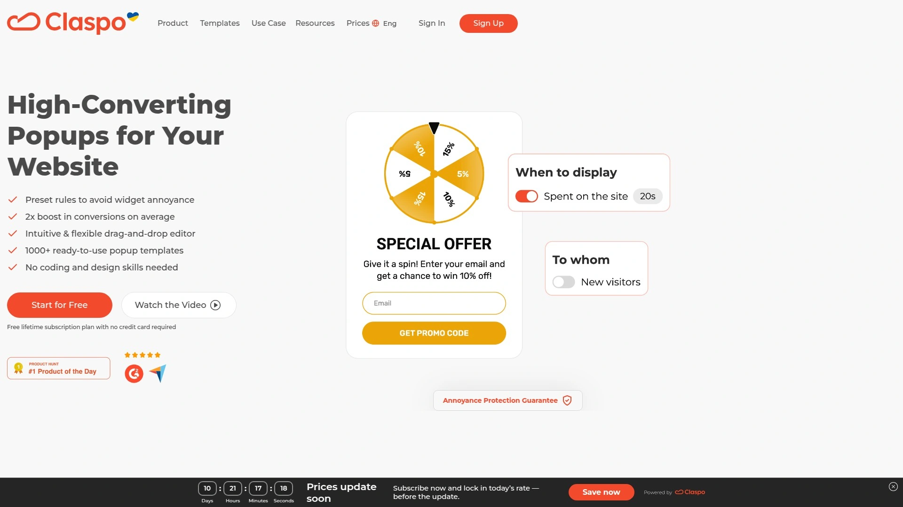

Claspo stands out for its genuinely free lifetime plan that doesn't feel like a trial in disguise. You get access to over 1,000 customizable templates right from the start, covering everything from spin-the-wheel gamification to exit-intent offers and newsletter signups. The drag-and-drop editor is intuitive enough that you'll have your first popup live in minutes, not hours.

What makes Claspo particularly useful is its built-in intelligence around popup display. It automatically prevents widget overlap, sets silence intervals between displays, and sequences multiple popups so your visitors don't feel bombarded. The mobile adaptation happens automatically, and you can set geographic and language-based targeting without touching any code.

For businesses serious about conversions, Claspo includes A/B testing in the free plan, built-in analytics that track impressions and conversion rates, and direct integrations with tools like Mailchimp, HubSpot, WooCommerce, and WordPress. The platform reports an average 2x boost in conversions for users, with some seeing conversion rate increases of 3.9 times after implementing their popups.

**Best for:** E-commerce stores, SaaS companies, and agencies managing multiple client sites who need professional results without a steep learning curve or monthly costs eating into margins.

***

## **[Wisepops](https://wisepops.com)**

Sophisticated onsite marketing that feels less like popups, more like personalized experiences.

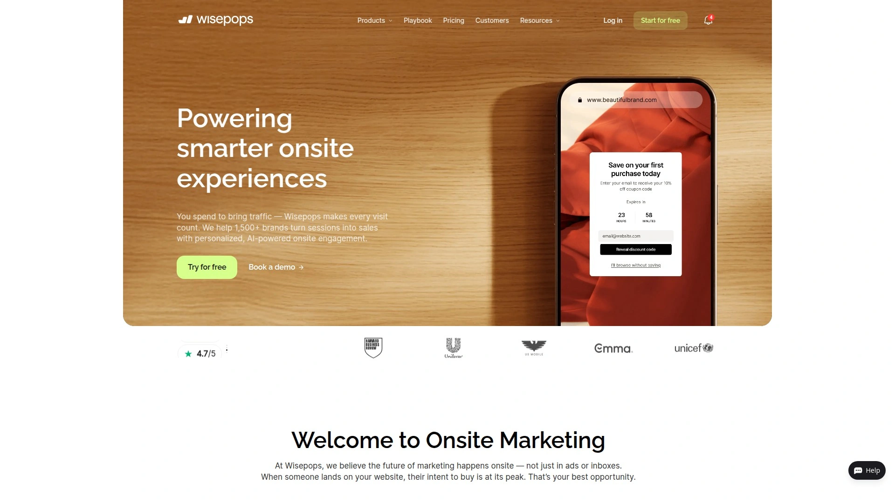

Wisepops serves over 1,500 brands with AI-powered personalization that goes deeper than basic popups. The platform offers multiple engagement types including popups, onsite feeds, web push notifications, and embedded forms. This variety lets you match the message format to visitor intent rather than forcing everything into a modal window.

The AI product recommendation engine is where Wisepops really shines. It analyzes visitor behavior and suggests relevant products or content, turning generic offers into targeted experiences. The platform tracks revenue attribution across channels, so you can see exactly how much money your popups generate.

Wisepops integrates with Klaviyo segments for email marketing, offers 30+ targeting options including cart value and customer lifetime value, and includes advanced A/B testing with statistical significance calculations. The pricing is transparent and based on pageviews rather than feature restrictions.

**Pricing starts at $49/month with a 14-day free trial.**

***

## **[OptinMonster](https://optinmonster.com)**

The heavyweight champion for advanced targeting and exit-intent technology.

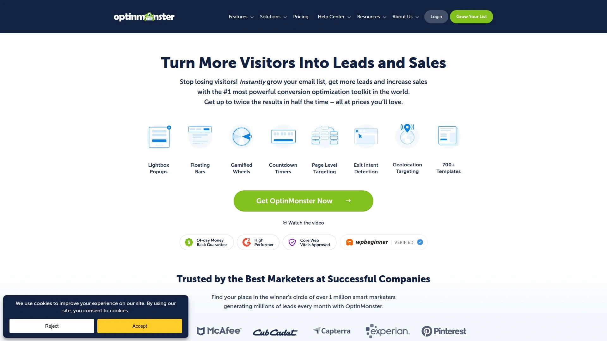

OptinMonster has earned its reputation through sheer power. The targeting capabilities go beyond typical "show after 10 seconds" rules. You can display popups based on referral source, past purchase history, scroll depth, mouse movement patterns, and even ad blocker detection. This granular control means the right people see the right message at the right time.

The exit-intent technology works particularly well, detecting when someone's about to leave and showing a last-chance offer. E-commerce stores use this to recover abandoning carts, while content sites use it to capture email subscribers before visitors bounce. The platform includes countdown timers, yes/no forms for engagement, and fullscreen welcome mats for high-impact messaging.

**Strengths:** Revenue tracking, geolocation targeting, device-specific campaigns, seamless WordPress integration, extensive third-party connections.

**Considerations:** No free plan available, steeper learning curve than simpler tools, pricing based on feature access rather than pageviews.

***

## **[OptiMonk](https://www.optimonk.com)**

Smart popups with personality, designed for online stores that want more than basic forms.

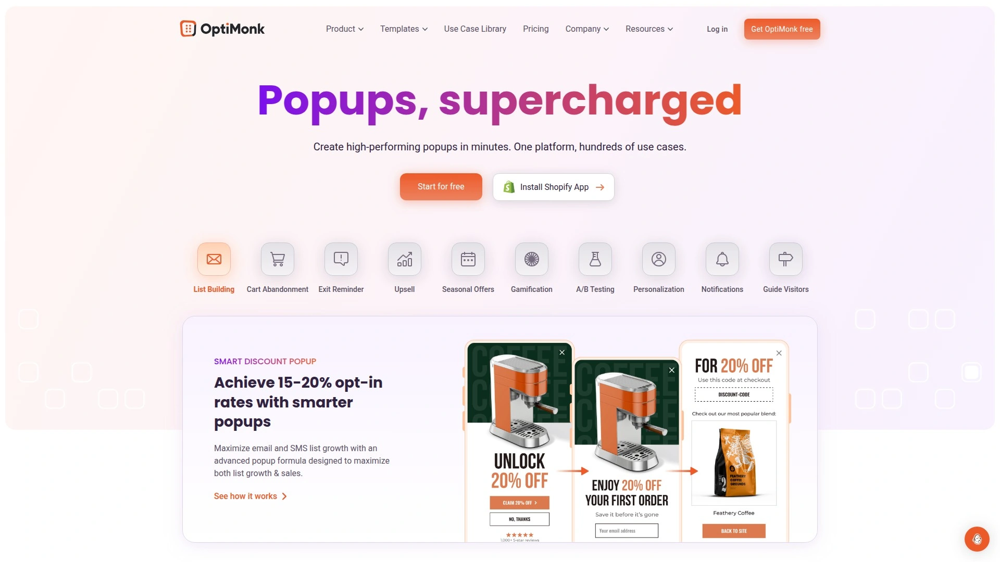

OptiMonk specializes in e-commerce conversion optimization with features built specifically for product-based businesses. The cart abandonment recovery system tracks what visitors add to their cart and triggers personalized popups offering incentives to complete the purchase. Product recommendation popups suggest complementary items based on browsing behavior, increasing average order value.

The platform's unique "Lucky Wheel" gamification creates interactive experiences that boost engagement rates significantly compared to static forms. Visitors spin a wheel to reveal their discount, making the signup process feel like a game rather than a transaction. OptiMonk also offers SMS collection popups, allowing you to build text message marketing lists alongside email subscribers.

Real-time personalization adjusts popup content based on traffic source, visitor location, device type, and on-site behavior. The platform works well for both small businesses testing their first popups and large enterprises running sophisticated segmentation strategies.

**Well-suited for Shopify stores, WooCommerce sites, and any e-commerce business focused on maximizing conversions from existing traffic.**

***

## **[Picreel](https://www.picreel.com)**

Conversion-focused popup builder with a money-back guarantee.

Picreel guarantees a 15-300% increase in leads and conversions, backing it up with a 30-day money-back policy. That's confidence worth noting. The platform tracks visitor digital footprints and click behavior in real-time, then serves the most relevant offer as people navigate your content.

Over 100 ready-made templates cover every use case from lead capture to cart abandonment to survey collection. The AI-powered personalization adjusts popup content dynamically based on what visitors are viewing, how long they've been on site, and their interaction patterns. You can recommend additional products, offer discounts, or provide surveys at precisely the moment engagement peaks.

The popup maker includes 700+ integrations with sales and marketing tools like MailChimp, Joomla, and Zapier. Advanced trigger options let you target specific audience segments with laser precision. A/B testing runs continuously to optimize conversion rates, and comprehensive analytics show exactly which popups drive the most value.

**Pricing begins at $9.99/month with a forever-free plan available.** The affordable entry point makes it accessible for startups while scaling up for growing businesses.

***

## **[Sleeknote](https://sleeknote.com)**

Popups that don't feel like popups, with multistep forms that keep visitors engaged.

Sleeknote's philosophy centers on non-intrusive engagement. Rather than disrupting the browsing experience, it displays popups at precisely calculated moments when visitors are most receptive. The multistep form capability breaks down information collection into digestible pieces, dramatically reducing form abandonment rates.

The platform includes an A/B testing engine that runs intelligent experiments automatically, testing different headlines, images, form fields, and timing triggers to find optimal combinations. Real-time analytics provide immediate feedback on campaign performance, letting you adjust strategies on the fly.

Sleeknote offers 15+ interactive elements including gamification features, countdown timers, and conditional logic that adapts based on visitor responses. The drag-and-drop editor supports extensive customization while maintaining mobile responsiveness across all devices.

Integration options include ActiveCampaign, Mailchimp, Shopify, BigCommerce, and most major marketing platforms. The mobile editor allows separate designs for phone users, ensuring popups look crisp regardless of screen size.

**Starting at $62/month, positioned for businesses serious about lead generation and conversion optimization.**

***

## **[Poptin](https://www.poptin.com)**

User-friendly popup creator with solid features at budget-friendly prices.

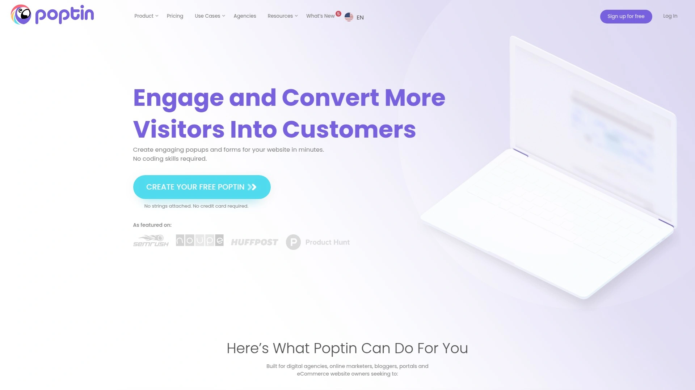

Poptin makes popup creation straightforward without sacrificing capability. The template library covers essential use cases from email collection to announcement bars to exit-intent offers. Each template is fully customizable through a visual editor that shows changes in real-time.

The platform's A/B testing scored highly in user reviews, with a 9.4 rating for robustness compared to competitors. You can test multiple variations simultaneously and let the system automatically declare winners based on conversion data. Targeting rules include URL-specific displays, time delays, scroll triggers, and exit intent detection.

Poptin works well for agencies and B2B companies focused on lead generation. The popup builder integrates with major email service providers and CRMs, automatically adding new subscribers to your lists. Form fields can be customized to collect whatever information matters most for your sales process.

**Notable strengths:** Affordable pricing, strong A/B testing capabilities, responsive customer support, straightforward setup process.

***

## **[Privy](https://www.privy.com)**

Built specifically for e-commerce with features that recover revenue.

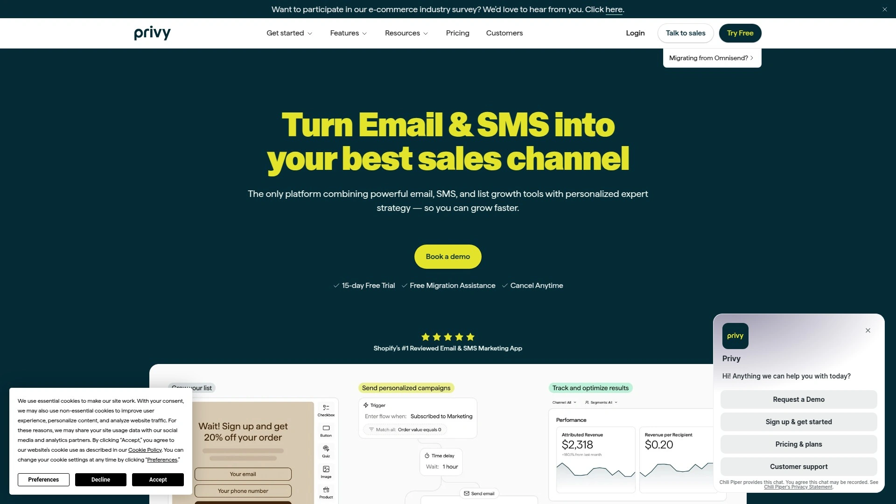

Privy focuses exclusively on helping online stores make more money. The cart abandonment tools track when shoppers add items but don't complete checkout, then display targeted popups offering small discounts or free shipping to seal the deal. This single feature often pays for the entire subscription.

Exit-intent popups appear when someone's about to leave, capturing email addresses in exchange for first-purchase discounts. Once you have those emails, Privy's built-in email marketing tools let you send follow-up campaigns without switching platforms. This integrated approach simplifies your marketing stack.

The platform is particularly popular among Shopify merchants due to its seamless integration with the Shopify ecosystem. Product recommendations, customer segmentation, and purchase history all sync automatically, enabling highly personalized popup campaigns.

**Best for Shopify stores and e-commerce businesses that want popup builder and email marketing in one place.** Pricing scales with your business size.

***

## **[BDOW! (formerly Sumo)](https://bdow.com)**

Free forever popup builder trusted by 30,000+ websites.

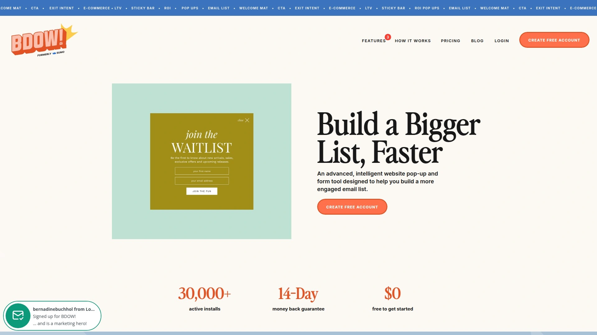

BDOW! offers genuinely free popup and form tools with no time limits or feature restrictions in the basic plan. You get access to popups, scroll boxes, inline forms, click triggers, welcome mats, and smart bars. For small businesses and bloggers, this provides everything needed to start building an email list without spending a dollar.

Advanced targeting rules show or hide popups based on URLs, pages, devices, referrer sources, visitor behavior, exit intent, cookies, and parameters. The platform makes it easy to display different messages to new visitors versus returning customers, or to show special offers only to people from specific traffic sources.

One-click A/B testing lets you experiment with different headlines, form fields, and messages. The system automatically tracks which variations perform better and helps you choose winners. WooCommerce integration adds monetization features specific to online stores, including cart abandonment reduction and upsell popups.

The interface has been updated to be 35% faster with enhanced integrations for ConvertKit, ActiveCampaign, Flodesk, Mailerlite, and Klaviyo. Agencies and designers can manage multiple client sites from a single dashboard.

**Free plan available forever, paid plans add advanced features for growing businesses.**

***

## **[Thrive Leads](https://thrivethemes.com/leads/)**

WordPress-native lead generation plugin for bloggers and content marketers.

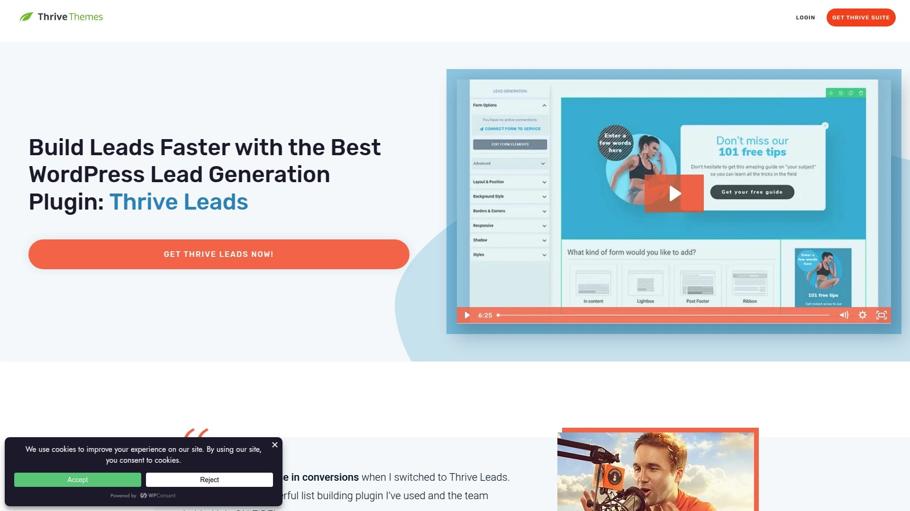

Thrive Leads lives entirely inside your WordPress dashboard, offering deep integration with categories, tags, and page templates. This native approach means you can target popups based on content type without external tools or custom code. A visitor reading blog posts about topic A sees different forms than someone browsing topic B content.

The plugin provides 10+ form types including lightbox popups, sticky ribbons, inline forms, 2-step opt-ins, slide-ins, widgets, screen fillers, content locks, scroll mats, and multiple choice forms. You can deploy several form types simultaneously for strategic conversion optimization.

Built-in A/B testing runs automatically, testing different headlines, images, offers, and triggers to find winning combinations. The drag-and-drop editor supports countdown timers, animations, and conditional logic without requiring coding knowledge. Mobile-responsive layouts ensure forms look professional on all devices.

**Ideal for WordPress bloggers, content marketers, and small business owners who want powerful lead generation without monthly fees.** One-time payment model, no recurring costs.

***

## **[Justuno](https://www.justuno.com)**

AI-driven targeting for e-commerce businesses obsessed with conversions.

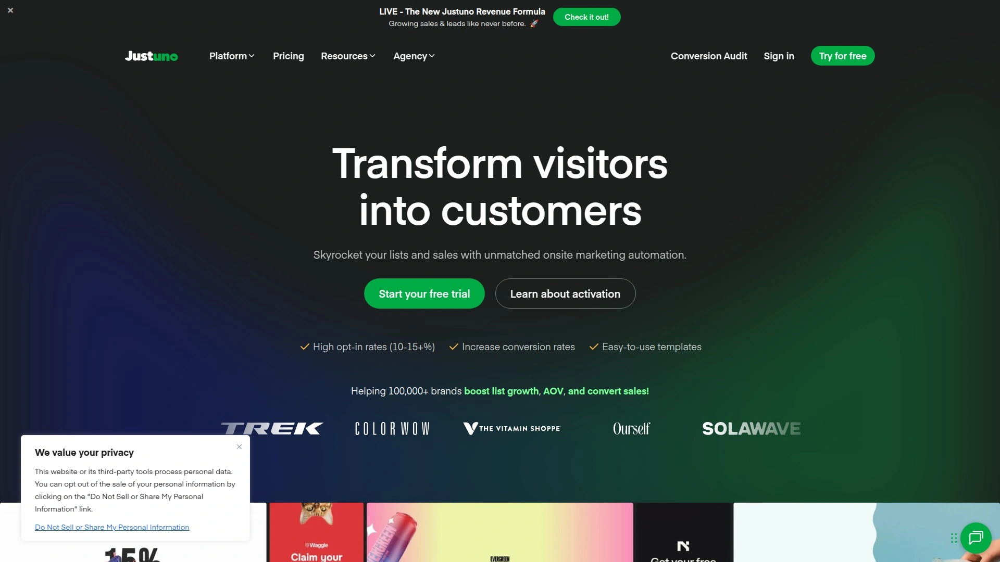

Justuno uses artificial intelligence to predict visitor behavior and display the most effective offers. The AI analyzes browsing patterns, product views, cart contents, and past purchase history to determine what each visitor is most likely to respond to. This intelligent targeting significantly outperforms generic popups.

Upsell popups appear after items are added to cart, recommending complementary products that increase average order value. Cart recovery features detect abandonment and display incentives to complete the purchase. Segmentation tools let you create different experiences for first-time visitors, returning customers, and VIP shoppers.

The platform includes advanced features like product recommendation engines, countdown timers for urgency, spin-to-win gamification, and multi-step forms that collect information progressively. Justuno works particularly well for Shopify and WooCommerce stores with significant traffic volumes.

**Designed for e-commerce businesses focused on maximizing revenue from existing traffic through intelligent personalization.**

***

## **[HelloBar](https://www.hellobar.com)**

Simple popup builder trusted by 600,000+ websites.

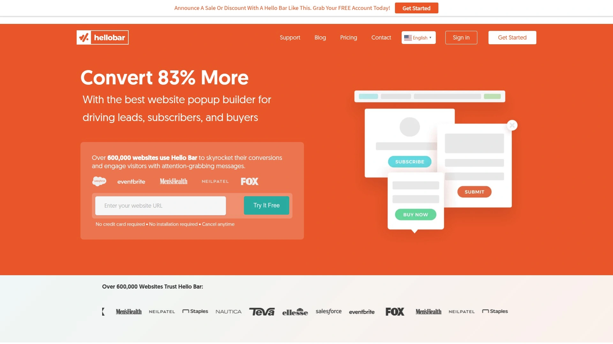

HelloBar lives up to its name with simplicity as the core value proposition. The popup builder is straightforward and award-winning, used by over 600,000 websites for one simple reason: it works. You can launch popup campaigns in minutes without technical knowledge.

The platform offers unlimited popups across different pages and visitor segments. Show one popup to newsletter subscribers and a different one to first-time visitors. Display special offers on product pages and email capture forms on blog posts. HelloBar's flexibility supports complex strategies despite its simple interface.

Goal-based campaign creation guides you through the process. Choose whether you want to collect emails, promote offers, drive social traffic, reduce cart abandonment, or encourage phone number collection. The builder then optimizes the popup design for that specific goal.

Integration options span major CMS platforms, email providers, and marketing tools. The script installs quickly across single pages or entire sites without requiring coding skills.

**Starting at $29/month, HelloBar fits small businesses, bloggers, and content marketers who value simplicity and reliability.**

***

## **[ConvertBox](https://convertbox.com)**

Intelligent on-site messaging with advanced personalization and conditional logic.

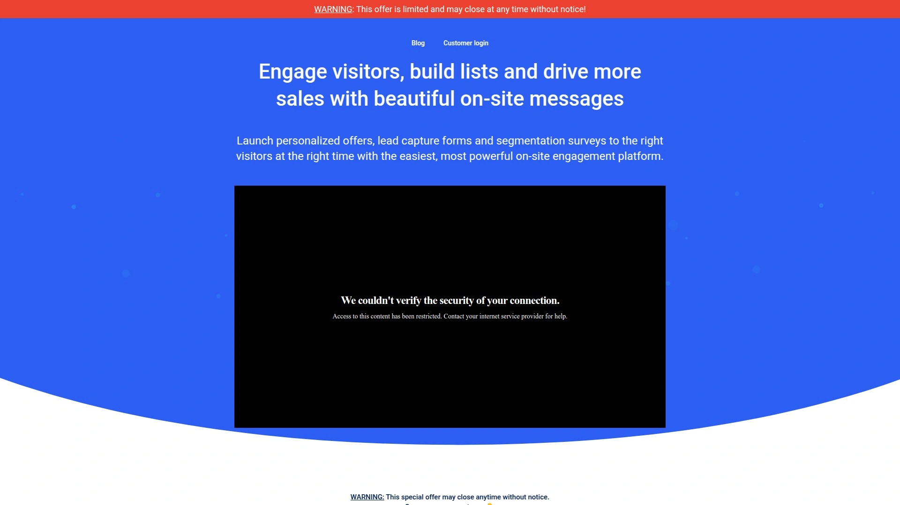

ConvertBox excels at creating personalized experiences through conditional actions and skip logic. Show specific popup steps based on previous selections, apply different CRM tags based on quiz scores, and skip visitors to targeted pages based on their answers. This conditional intelligence creates conversation-like experiences rather than one-size-fits-all forms.

On-site surveys and quizzes engage visitors while collecting valuable segmentation data. The platform includes analyzing screens that show visitors you're calculating personalized results, boosting perceived value. Progress bars keep people engaged through multi-step forms that would otherwise feel overwhelming.

Display options include slide-in notifications, center modals, sticky bars, full-page takeovers, and embedded forms within content or sidebars. A/B testing and robust analytics measure what drives the best results. The template library provides gorgeous starting points for every stage of your sales process.

**Well-suited for marketers running sophisticated segmentation strategies and businesses that want quiz-style engagement.** Early access lifetime deal available.

***

## **[Unbounce Popups](https://unbounce.com/product/popups-and-sticky-bars/)**

Landing page power applied to popups and sticky bars.

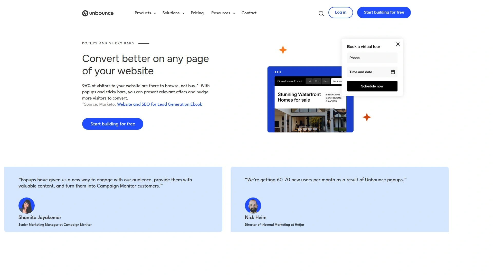

Unbounce built its reputation on high-converting landing pages, and that expertise translates beautifully to popups. The drag-and-drop builder includes Smart Copy AI that generates optimized headline ideas in seconds, removing writer's block from the equation.

Popups and sticky bars work on any webpage, not just Unbounce landing pages. Create targeted offers for specific URLs, set triggers based on exit intent or scroll depth, and control frequency to avoid annoying repeat visitors. The builder supports both desktop and mobile designs with separate customization for each.

Templates are optimized for conversion based on data from millions of visitors across the Unbounce network. Choose from professionally designed options for email capture, special promotions, demo bookings, or cart abandonment. Customize everything from colors and copy to form fields and images.

Goal tracking marks conversions for button clicks or form submissions. URL targeting controls exactly where popups appear. Trigger options include on arrival, on exit, after scroll percentage, or time delay.

**Best for businesses already using Unbounce landing pages, or marketers who want proven high-conversion templates.** Pricing includes access to full landing page platform.

***

## **[Popupsmart](https://popupsmart.com)**

AI-powered targeting for small businesses looking for smart popups.

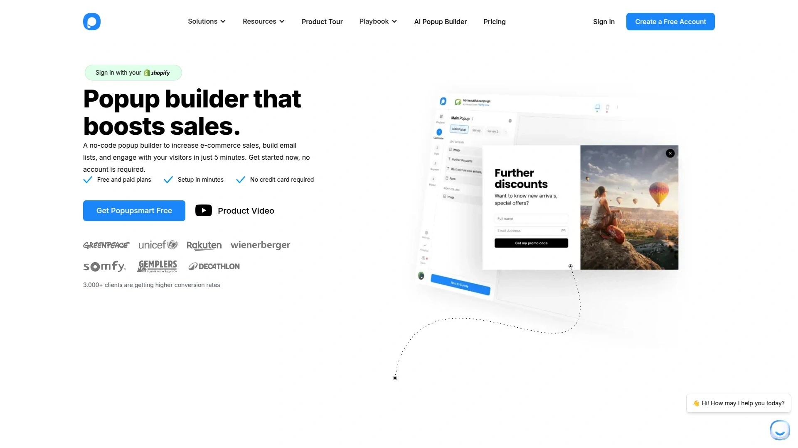

Popupsmart uses artificial intelligence to optimize popup display timing and targeting. The AI learns from visitor behavior patterns and automatically adjusts when and how popups appear to maximize engagement without irritating users. This hands-off optimization saves hours of manual testing.

Built-in email features let you manage basic email marketing without separate tools. Collect addresses through popups and send follow-up campaigns from the same dashboard. For small businesses, this integrated approach simplifies the marketing technology stack.

The platform offers behavior-based triggers including exit intent, scroll depth, time on page, click actions, and inactivity detection. Device targeting shows different popups to mobile versus desktop users. Geolocation targeting displays region-specific offers or languages.

Templates cover essential use cases with customization options for branding. The interface is designed for non-technical users, with straightforward controls and helpful tooltips throughout the builder.

**Affordable and accessible for small businesses, startups, and solopreneurs who want AI-powered popup optimization without complexity or high costs.**

***

## FAQ

**What's the difference between free and paid popup builders?**

Free plans typically limit active popup campaigns, pageviews, or advanced features like A/B testing and detailed analytics. They work fine for small sites testing the concept. Paid plans remove those limits and add sophisticated targeting, deeper integrations, priority support, and white-label options for agencies. If you're seeing decent results with free tools, upgrading usually multiplies those results through better targeting and testing capabilities.

**How do I make popups that don't annoy visitors?**

Timing and relevance are everything. Display popups based on behavior like scroll depth or exit intent rather than immediately on page load. Show first-time visitors welcome offers, but don't keep showing the same popup to people who already subscribed. Use the silence interval features built into tools like Claspo to space out displays. Keep the close button obvious and respect when someone dismisses your popup.

**Which popup builder works best for small e-commerce stores?**

Claspo offers the most generous free plan with full functionality, making it ideal for stores testing popup strategies without upfront investment. As you scale, Privy provides e-commerce-specific features like cart abandonment and email marketing in one platform. OptiMonk excels at product recommendations and gamification. The right choice depends on whether you prioritize cost, specific features, or ease of use.

***

## Conclusion

The popup builders above represent the most reliable options for capturing attention and driving conversions in 2025. Each platform has strengths for different business types and budgets. If you're just starting out or want maximum functionality without immediate costs, [Claspo](https://claspo.io) stands out for its lifetime free plan that includes the full feature set most businesses need. The 1,000+ templates, built-in A/B testing, automatic mobile optimization, and non-intrusive display rules make it particularly suitable for e-commerce stores, SaaS platforms, and agencies managing multiple client sites. Start with what fits your current needs, measure the results, and scale up as your traffic grows.
